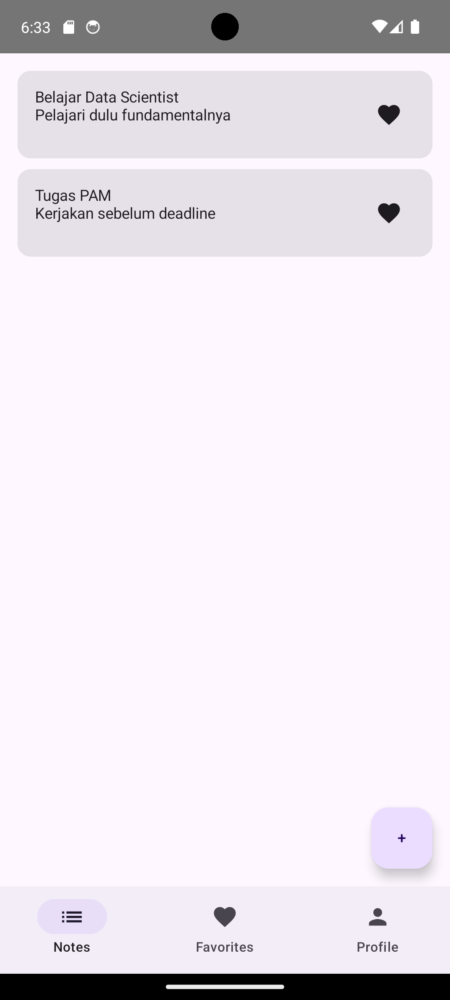
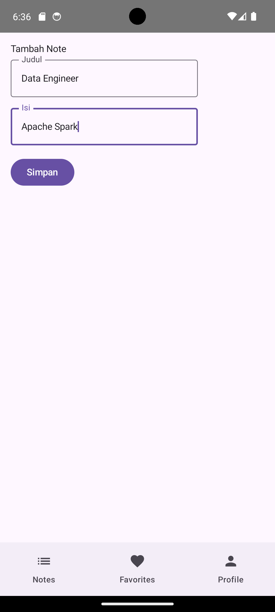
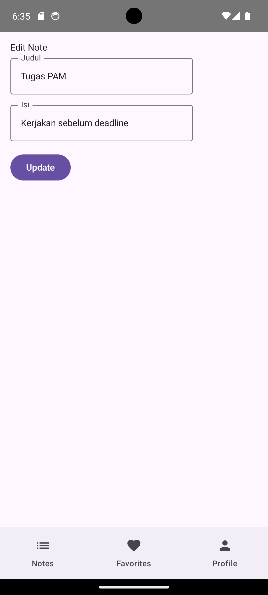
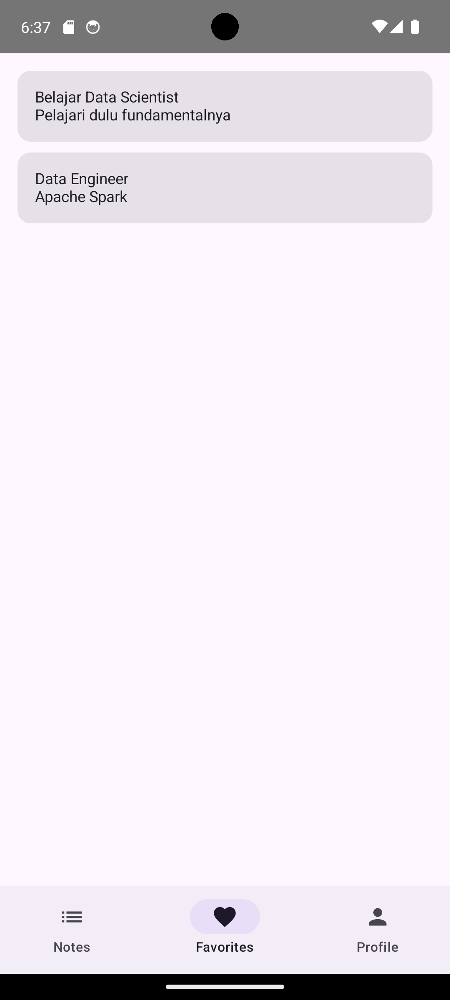

# Notes App 

Aplikasi ini mengimplementasikan navigasi antar layar serta manajemen state menggunakan ViewModel.

---

## Fitur Utama

### Notes
- Menampilkan daftar catatan
- Menambahkan catatan baru
- Melihat detail catatan
- Mengedit catatan

### Favorites
- Menandai catatan sebagai favorit
- Menampilkan daftar catatan favorit

### Profile
- Menampilkan informasi profil
- Edit profil (nama & bio)
- Toggle dark mode

---

## Navigasi

Aplikasi ini menggunakan **Navigation Compose** dengan struktur:

- Bottom Navigation:
  - Notes
  - Favorites
  - Profile

- Alur Navigasi:
Notes → Detail → Edit → Add Note

---

## 🛠️ Teknologi yang Digunakan

- Kotlin
- Jetpack Compose
- Navigation Compose
- ViewModel (State Management)
- Material 3

---

## Arsitektur

Aplikasi menggunakan pendekatan sederhana berbasis:
- `ViewModel` untuk mengelola state
- `StateFlow` untuk reactive UI
- Shared ViewModel antar screen untuk sinkronisasi data

---

## Dokumentasi Aplikasi

### Halaman Notes

### Tambah Note

### Edit Note

### Favorites

